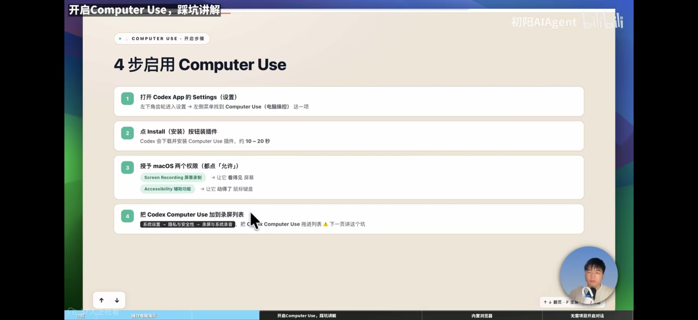
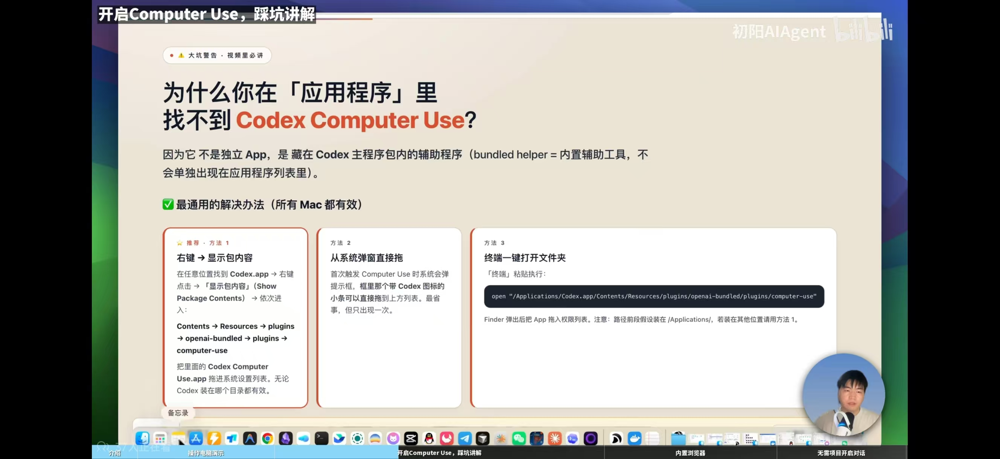

# 开启 Codex Computer Use：4 步搞定，顺手避开 macOS 最大的坑

很多人第一次开启 `Codex Computer Use`，卡的不是安装，而是权限。

最典型的情况就是：

- 插件明明装好了
- 系统也提示去授权
- 但到了 macOS 权限设置这一步，怎么都找不到 `Codex Computer Use`

于是很多人就开始怀疑：

> 是不是没装成功？  
> 是不是版本不对？  
> 是不是路径错了？

其实大多数时候，问题都不是安装失败，而是你找错地方了。

这篇文章我就把整个流程一次讲清楚：
**怎么安装、怎么授权、为什么你在“应用程序”里找不到 `Codex Computer Use`，以及怎么正确把它加进权限列表。**

如果你还没有可用的 Codex 账号，也可以先把入口存一下：如需 Codex，可通过 Maynor AI 开通，完整链接是：https://maynorai.jichiyun.sbs/buy/13 ，当前是每天 `150 刀` 的额度。

---

## 一、Computer Use 到底是什么？

简单理解，`Computer Use` 就是让 Codex 拥有两种能力：

- 看屏幕
- 操作鼠标键盘

也就是说，开通之后，它才能真正帮你：

- 点击按钮
- 输入文字
- 切换窗口
- 滚动页面
- 操作网页和桌面 App

在 macOS 上，这件事依赖两个关键权限：

- `Screen Recording（屏幕录制）`
- `Accessibility（辅助功能）`

它们分别负责两件事：

- **屏幕录制**：让它“看得见”
- **辅助功能**：让它“动得了”

少任何一个，Computer Use 都很难正常工作。

---

## 二、开启 Computer Use，只要 4 步



### 第 1 步：打开 Codex App 的设置页

先打开 `Codex App`，进入 `Settings（设置）`。

通常可以从左下角的齿轮进入，然后在左侧菜单中找到：

`Computer Use（电脑操控）`

### 第 2 步：点击 Install 安装插件

进入 `Computer Use` 页面后，点击 `Install（安装）`。

Codex 会自动下载并安装对应插件，通常只需要 **10～20 秒**。

这一部完成后，才算真正具备了后续申请系统权限的前提。

### 第 3 步：授权 macOS 两个权限

安装完成后，系统会提示你授权。这里有两个权限都要点“允许”：

- `Screen Recording（屏幕录制）`
- `Accessibility（辅助功能）`

这两个权限的作用可以记成一句话：

> 一个负责看，一个负责动。

如果你只开了其中一个，常见问题会是：

- 能看到界面，但点不了
- 好像执行了动作，但状态读取不对
- 某些页面能操作，某些页面完全不行

所以这两个权限，**缺一不可**。

### 第 4 步：把 Codex Computer Use 加到权限列表里

这一步是最容易翻车的地方。

进入 macOS 的：

`系统设置 -> 隐私与安全性 -> 录屏与系统录音`

然后把 `Codex Computer Use` 加进去。

问题来了，很多人到了这里会发现：

> 我在“应用程序”里根本找不到 `Codex Computer Use` 啊？

别急，这正是最大坑点。

---

## 三、为什么你在“应用程序”里找不到 Codex Computer Use？



原因其实很简单：

`Codex Computer Use` **不是一个独立 App**，  
它是藏在 `Codex.app` 主程序包内部的一个辅助程序（bundled helper）。

这意味着：

- 它不会像普通软件一样单独出现在“应用程序”目录里
- 你不能直接在 `/Applications` 下面看到它
- 你需要进到 `Codex.app` 的包内容里，才能找到它

所以，**不是你没装成功，而是它本来就不在那里。**

---

## 四、最稳的方法：从 Codex.app 包内容里把它找出来

这是最通用、最稳妥的方法，几乎所有 Mac 都适用。

### 方法 1：右键“显示包内容”

1. 找到 `Codex.app`
2. 右键点击
3. 选择 `显示包内容（Show Package Contents）`
4. 按下面路径继续进入：

```text
Contents -> Resources -> plugins -> openai-bundled -> plugins -> computer-use
```

进入这个目录后，你就能看到：

```text
Codex Computer Use.app
```

然后把它拖进系统权限列表即可。

---

## 五、另外两种更快的方法

### 方法 2：首次弹窗时直接拖进去

有些时候，你第一次触发 `Computer Use` 时，macOS 会弹出权限提示。

这时系统界面里可能会出现一个和 `Codex` / `Computer Use` 相关的小图标，你可以直接把它拖到对应权限区域。

这个方法的优点是快，缺点是：

- 只在第一次触发时比较容易遇到
- 弹窗有时一闪而过
- 不一定每次都能复现

所以如果你已经错过了，还是建议用“显示包内容”的办法，最稳。

### 方法 3：终端一键打开对应文件夹

如果你的 `Codex.app` 就装在 `/Applications`，可以直接运行下面这条命令：

```bash
open "/Applications/Codex.app/Contents/Resources/plugins/openai-bundled/plugins/computer-use"
```

运行后，Finder 会直接打开对应目录。

接下来你只需要把里面的 `Codex Computer Use.app` 拖进系统权限列表即可。

不过要注意，这条命令默认假设你的 Codex 安装在：

```bash
/Applications/Codex.app
```

如果你把 Codex 放在别的位置，比如桌面、下载目录、外置磁盘，那这条命令就不一定适用。这时候还是推荐你用前面的 **“右键 -> 显示包内容”** 方法。

---

## 六、权限到底要开哪几个？

如果你想少走弯路，可以直接记住这两个最关键。

### 1）Screen Recording（屏幕录制）

作用：让 Computer Use 能看到当前屏幕内容。

没有它，Codex 很可能：

- 无法读取当前窗口状态
- 看不到网页内容
- 不知道该点哪里

### 2）Accessibility（辅助功能）

作用：让 Computer Use 能控制鼠标和键盘。

没有它，Codex 很可能：

- 无法点击按钮
- 无法输入文字
- 无法执行快捷键
- 无法滚动页面

---

## 七、配置完成后，怎么判断自己成功了？

当下面这几件事都满足时，基本就算配置成功：

- `Computer Use` 插件已经安装完成
- `Screen Recording（屏幕录制）` 已授权
- `Accessibility（辅助功能）` 已授权
- 系统权限列表里能看到 `Codex Computer Use`

如果这些都完成了，但还是不生效，建议再做这几步：

- 完全退出 `Codex`，重新打开
- 再触发一次 `Computer Use`
- 检查是不是只开了一个权限
- 检查加入权限列表的是不是 `Codex Computer Use.app`

---

## 八、最常见的 3 个坑

### 坑 1：在“应用程序”里死找 `Codex Computer Use`

这是最常见的问题。

因为它根本不是独立 App，而是藏在 `Codex.app` 包里的 helper。

所以正确思路不是继续去“应用程序”里翻，而是直接打开 `Codex.app` 包内容顺着目录进去找。

### 坑 2：只开了屏幕录制，没开辅助功能

很多人会误以为“能看见屏幕就够了”。

其实不是。

`Screen Recording` 只能解决“看见”的问题，真正要完成点击、输入、切换窗口，还得依赖 `Accessibility`。

### 坑 3：已经装了 Codex，但权限列表里没有 Computer Use

这不一定是安装失败。

很多时候只是因为：

- 你还没进入正确目录
- 还没把 helper 拖到权限列表
- 或者你加的是主程序，不是 `Codex Computer Use`

---

## 九、一句话总结

如果你只记住一句话，那就是：

> 开启 Codex Computer Use 的核心，不是安装，而是权限和路径。

真正的正确流程是：

1. 在 Codex 设置里安装 `Computer Use`
2. 给 macOS 授权 `屏幕录制` 和 `辅助功能`
3. 去 `Codex.app` 包内容里找到 `Codex Computer Use.app`
4. 把它加入系统权限列表

你在“应用程序”里找不到它，不是你操作错了，而是它本来就不在那里。

---

## 十、附：最省事的操作路径

如果你想直接照着做，可以按这个顺序：

```text
Codex 设置 -> Computer Use -> Install
-> 授权 Screen Recording
-> 授权 Accessibility
-> 右键 Codex.app -> 显示包内容
-> Contents -> Resources -> plugins -> openai-bundled -> plugins -> computer-use
-> 找到 Codex Computer Use.app
-> 拖进系统权限列表
```

如果你的 Codex 安装在 `/Applications`，也可以直接执行：

```bash
open "/Applications/Codex.app/Contents/Resources/plugins/openai-bundled/plugins/computer-use"
```

---

## 十一、顺手附上 Codex 入口

如果你看完这篇，准备自己上手试一下 `Computer Use`，最实际的前提还是先有一个可用的 Codex 订阅。

这里顺手放下入口，免得你再到处找：

- 如需 Codex：可通过 Maynor AI 开通，完整链接：https://maynorai.jichiyun.sbs/buy/13
- 额度说明：每天 `150 刀` 的额度
